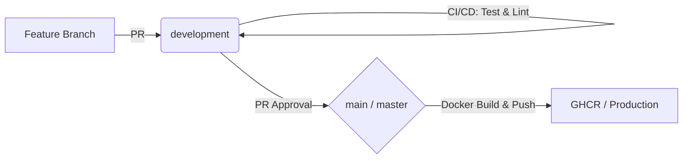

# Nerdlab Back-End // The Digital Singularity 🌌

A espinha dorsal tecnológica do ecossistema Nerdlab. Uma API de alta performance construída com Java e Spring Boot, focada em escalabilidade, segurança e automação industrial de processos.

## 🛠️ Tech Stack Core
- **Java 21** & **Spring Boot 3.4.5**
- **Spring Security** (JWT + Role Based Access)
- **Tomcat 10.1.52** (Hardened)
- **PostgreSQL** & **Flyway** (Migrations)
- **Trivy** (Security Scan) & **SonarQube** (Quality Gate)

## 🔄 Fluxo de Desenvolvimento (Eltie Pipeline)

Seguimos um esquema rigoroso de esteiras para garantir a estabilidade do sistema:



1.  **Feature**: Todo novo recurso deve nascer em uma branch `feature/*`.
2.  **Pull Request (Dev)**: Gatilho automático para Security Scan (Trivy) e Quality Gate (Sonar).
3.  **HML/Test**: Validação em ambiente de `development`.
4.  **Production (Main)**: Merge realizado apenas após aprovação técnica e verde em todos os scans.

---

## 🚀 Como Rodar
```bash
./mvnw spring-boot:run
```

## 🛡️ Segurança
Este projeto utiliza **Security Hardening** agressivo. Todas as dependências são auditadas diariamente via Trivy para garantir conformidade com CVEs críticos.
